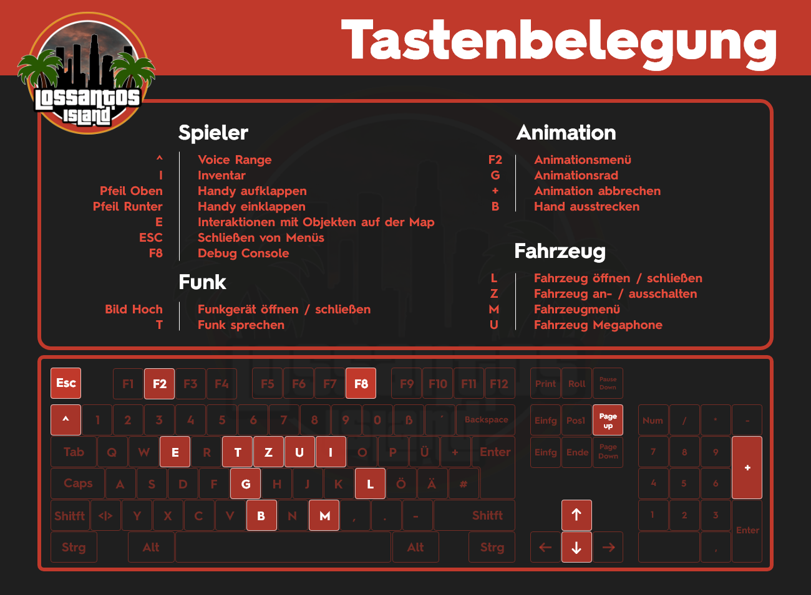

# Tastenbelegung

<figure><figcaption></figcaption></figure>

<table><thead><tr><th width="137.33333333333331">Taste</th><th width="258">Bezeichung</th><th>Funktion</th></tr></thead><tbody><tr><td>^</td><td>Voice-Range</td><td>Einstellung der 4 Voice-Rang stufen</td></tr><tr><td>I</td><td>Inventar</td><td>Öffnen das eigene Spielerinventar</td></tr><tr><td>Pfeil Oben</td><td>Handy aufklappen</td><td>Benutze dein Handy</td></tr><tr><td>Pfeil Runter</td><td>Handy einklappen</td><td>Leg dein Handy weg</td></tr><tr><td>E</td><td>Interaktion mit Objekten</td><td>Interaktion mit Objekten auf der Map</td></tr><tr><td>ESC</td><td>Schliessen von Menüs</td><td>Schliessen deine offenen Menüs</td></tr><tr><td>F8</td><td>Debug Console</td><td>Du findest einen Fehler? Mach ein Bild von der Console</td></tr><tr><td>Bild Hoch</td><td>Funkgerät öffnen / Schliessen </td><td>Benutze dein Funkgerät und leg es wieder weg</td></tr><tr><td>T</td><td>Funk sprechen</td><td>Sprich im Funk </td></tr><tr><td>F2</td><td>Animationsmenü</td><td>Öffne ein Menü mit Animationen</td></tr><tr><td>G</td><td>Animationsrad</td><td>Leg deine wichtigsten Animationen auf die schnell Auswahl</td></tr><tr><td>B</td><td>Hand ausstrecken</td><td>Zeig mit dem Finger auf jemanden</td></tr><tr><td>L</td><td>Fahrzeug öffnen / schliessen</td><td>Öffne und schliesse dein Fahrzeug</td></tr><tr><td>Z</td><td>Fahrzeug an- / ausschalten</td><td>Starte den Motor und schalte ihn wieder aus</td></tr><tr><td>M</td><td>Fahrzeugmenü</td><td>Öffne das Fahrzeugmenü</td></tr><tr><td>U</td><td>Fahrzeug Megaphone</td><td>Sprich durch die Lautsprecher</td></tr></tbody></table>
