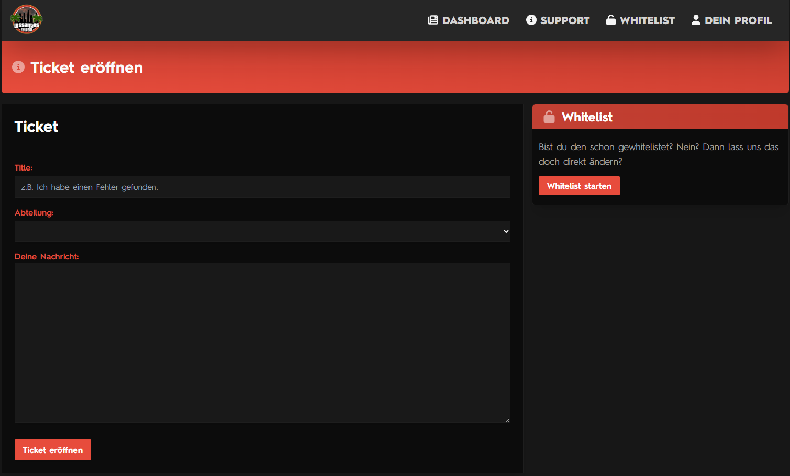

# Support-Tickets und Bugmeldungen

### Support-Ticket einreichen

Du hast eine Frage zu einem allgemeinen Thema? \
\
Dann melde dich via&#x20;

* Ticket auf der [Webseite](https://lossantosisland.de/) &#x20;
* [TeamSpeak-Support](ts3server://lossantosisland.de)

***

### Meldung über die Webseite

1. Gehe auf die [Webseite](https://lossantosisland.de/) und melde dich an&#x20;
2. Klick in der oberen Leiste auf "Support"
3. Klicke unten links auf "Ticket öffnen"
4. Schreibe nun einen entsprechenden Titel (BSP Bugmeldung / Konzept / RP-Situation melden)
5. Wähle die entsprechende Abteilung aus.&#x20;
6. Schildere nun dein Anliegen in "Deine Nachricht"
7. "Ticket eröffnen" um das Ticket abzusenden

<figure><figcaption></figcaption></figure>

***

### Meldung über TeamSpeak

1. Gehe auf unseren [TeamSpeak](ts3server://lossantosisland.de) in den Bereich Support in den Warteraum
2. Fordere Talkpower an mit einem aussagekräftigem Grund
3. Ein Supporter/In wird sich um dich kümmern

_Supportzeiten auf dem TeamSpeak Täglich von 18:00Uhr bis 20:00Uhr_ &#x20;

***

### Aufnahmeprogramm

Um uns in diversen Situationen den Support einfacher zu machen, ist es immer von Vorteil, ein Video zu haben. Medal.tv oder Nvidia ist dafür eine gute Option. Das Programm nimmt dein RP auf und Speichert es nur auf deinen Befehl. So kannst du, wenn du in einer RP-Situation landest, welche du melden musst direkt Handeln.&#x20;

* [https://medal.tv/de](https://medal.tv/de)
* [Nvidia](https://www.nvidia.com/de-de/geforce/geforce-experience/shadowplay/)&#x20;

***

### Bugmeldungen

Du hast einen Bug entdeckt? Dann gehe bitte so vor!

* Mache dir Schriftlich Notizen, wie es zu dem Bug gekommen ist
* Wenn möglich Screenshots oder Videos machen
* Denk darüber nach, ob der Fehler auch von deiner Seite aus kommen könnte

Melde dich mit den Notizen und dem Bild/Videomaterial über das Ticket System. **(Bugmeldungen über TeamSpeak können nicht bearbeitet werden)**&#x20;

***
