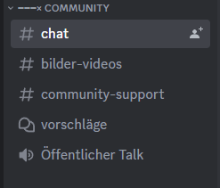
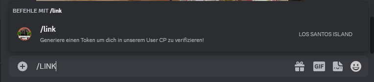

# Programme / Webseite

### Programme&#x20;

* [AltV](https://altv.mp)&#x20;
* [Teamspeak 3 Version 3.6.1](https://www.teamspeak.com/de/downloads/) &#x20;
* [Teamspeak 3 Addon ](https://staticcdn.lossantosisland.de/uploads/yaca.ts3\_plugin)
* [Discord](https://discord.com)&#x20;
* GTA V (Kann verschiedenen Orten erwerbt werden, BSP [Steam](https://store.steampowered.com/)).

***

### Installation AltV

1. Gehe auf [AltV](https://altv.mp) zu "Download" und drücke Download Client.
2. Öffne in deinen Dateien die Festplatte, auf der du GTA installiert hast.
3. Rechtsklick in das geöffnete Fenster und navigiere zu "Neu" -> "Ordner".
4. Erstelle einen neuen Ordner mit Namen "AltV".
5. Zieh die Datei altv.exe (Download von AltV) in den leeren Ordner und öffnet sie.
6. Wähle den Ort aus, wo du GTA V installiert hast.
7. AltV sollte sich jetzt öffnen und unter Settings kannst du die Seite auf Deutsch stellen

***

### Installation Teamspeak 3 / Addon&#x20;

1. [Teamspeak](https://www.teamspeak.com/de/downloads/) Download
2. Teamspeak 3 [Addon](https://staticcdn.lossantosisland.de/uploads/yaca.ts3\_plugin) Download und instalieren
3. Teamspeak Neustarten und oben in der Leiste auf Extras und dann Optionen
4. Unter Erweiterungen aktiviert ihr das Addon (Yet-Another-Communication-Addon)

***

### Installation Discord

1. Discord Download [(Link)](https://discord.com/).
2. Mach dir ein Konto und komm auf unseren [Discord](https://discord.gg/R5MgBVwEF5).
3. Lese die Regeln durch!!!

***

### Webseite mit Discord verbinden

1. Gehe auf dem [Discord](https://discord.gg/R5MgBVwEF5) im Bereich Community in den Chat&#x20;

<figure><figcaption></figcaption></figure>

2. Schreibe /link&#x20;

<figure><figcaption></figcaption></figure>

3. Klicke auf den vorgeschlagenen Link von Discord und sende es ab.
4. Kopiere den Token den du bekommst
5. Geha auf die [Webseite](https://lossantosisland.de/) und mach dir ein Konto
6. Klick auf "Dein Profil" und "Konto Bearbeiten"
7. Klick auf "Konto Verbinden" und geben den Token ein

### Webseite mit Teamspeak verbinden

1. Gehe auf unseren [TeamSpeak](ts3server://lossantosisland.de)
2. Du wirst direkt von LOS SANTOS ISLAND angeschrieben mit den [Nutzungsbedingungen](https://lossantosisland.de/tos). Alles durchlesen
3. !link in den Chat und der Bot schickt dir dein Token
4. Token kopieren und auf der [Webseite](https://lossantosisland.de/) unter "Dein Profil" -> "Konto bearbeiten"  kannst du den Token einfügen und dein TS mit der Webseite verbinden.&#x20;
